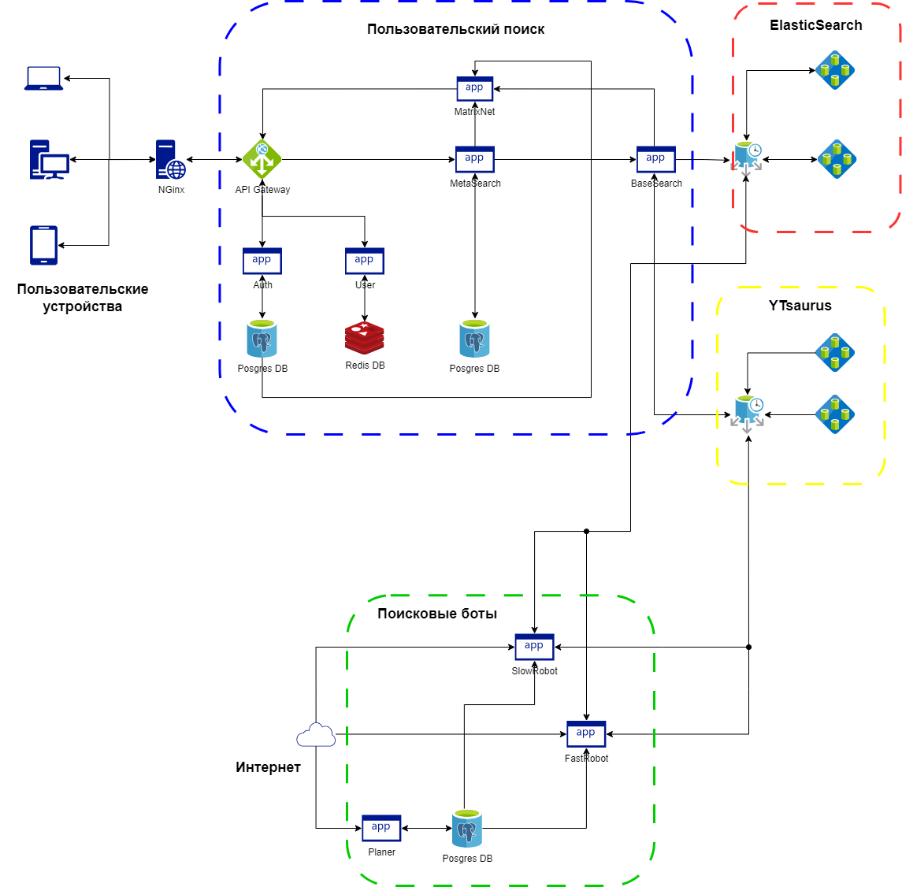

# Проектирование высоконагруженного пространства для командной работы
Курсовая работа в рамках 3-го семестра программы по Веб-разработке ОЦ VK x МГТУ им. Н.Э. Баумана (ex. "Технопарк") по дисциплине "Проектирование высоконагруженных сервисов"

__Автор__ - [AlfaIV](https://github.com/alfaiv) 
__Задание__ - [Методические указания](https://github.com/init/highload/blob/main/homework_architecture.md) 
__[Таблица отчетности](https://vk.com/away.php?to=https%3A%2F%2Fdocs.google.com%2Fspreadsheets%2Fd%2F1XhRgeQARIXGoiTSYQStW4GTlXJ62-jgL36c2i8HvYJ4%2Fedit%3Fusp%3Dsharing&cc_key=)__

## Содержание

- [1. Функционал и продуктовые метрики](#chapter-one)
- [2. Расчет нагрузки](#chapter-two)
- [3. Глобальная балансировка нагрузки](#chapter-tree)
- [4. Локальная балансировка нагрузки](#chapter-four)
- [6. Физическая схема БД](#chapter-six)
- [7. Алгоритмы](#chapter-seven)
- [8. Технологии](#chapter-eight)
- [9. Обеспечение надежности](#chapter-nine)
- [10. Схема проекта](#chapter-ten)
- [11. Список серверов](#chapter-eleven)
- [Используемые источники](#sorce)

## 1. Функционал и продуктовые метрики

__Функциональные возможности__ - это поисковая система. Она позволяет пользователям искать информацию в интернете, включая веб-страницы, изображения, видео, новости и другие типы контента.

__Целевая аудитория__ - в результате исследования данной темы, конкретного количества пользователей поисковый системы Яндекс не было найдено. Поэтому использовалась следующая логика. В основном аудитория данного сервиса - _русскоязычные пользователи интернета_ - рунет. [Согласно статистике](https://www.web-canape.ru/business/statistika-interneta-i-socsetej-na-2023-god-cifry-i-trendy-v-mire-i-v-rossii/) в России 127.6 миллионов пользователей Интернета. Согласно сервису [Яндекс Радар](https://radar.yandex.ru/search?period=all&selected_rows=iHMJ0E%252CvDPqTi%252C8fg2y0%252Ctmkupd%252CMCj1FA) пользователи Яндекса составляют 64.25% от общего числа пользователей поисковых систем. Таким образом, можно предположить, что количество пользователей составляет ``127.6E6*0.64 = 76E6``. 

Ниже представлена таблица, показывающая долю пользователей Яндекс из разных стран:

 Страна         |  Процент пользователей Яндекс поиска
----------------|------------------------
 Россия         |   95.04%
 Украина        |    0.89%
 Беларусь       |    0.66%
 Нидерланды     |    0.27%
 Молдова        |    0.27%
 Другие         |    2.87%

Для определения метрик DAU и MAU возьмем данные с сайта [HypeStat](https://hypestat.com/info/ya.ru):

- количество пользователей ~ 81,66M
- MAU ~ 44,9M
- DAU ~ 15,8M

__Ключевой функционал:__

- Регистрация и авторизация
- Поиск веб-страниц
- История поиска

## 2. Расчет нагрузки

__Продуктовые метрики__

Среднее количество действий пользователя можно оценить следующим образом. Т.к. данный сервис представляет собой поисковую систему, то вероятнее всего, что в общем случае сценарий использования сервиса следующий: пользователей заходит на главную поисковую страницу, набирает запрос и пользуется пагинатором. Согласно [5] страниц за визит 5,8 значит 3-4 перехода пользователь проводит за сеанс использования ресурса. 

Прикинем размер истории пользователя. Допустим, символы в истории пользователя кодируются UTF-8, тогда размер символа - 1 байт. 2 000 символов - максимальный размер URL адреса. _По собственному опыту_ ежедневного использования браузера, имею порядка 100 000 записей в истории. Таким образом, ``1 байт *2 000 символов * 100 000 записей = 200Гб``. Предположим, что история сжимается каким-либо алгоритмом, в среднем на 40%. Таким образом, получим следующий результат ``200Гб * (1 - 0.4) = 120Гб``

Таким образом, имеем следующие продуктовые метрики:

 Продуктовая метрика                      |Значение
------------------------------------------|--------
 MAU                                      | 44,9М  
 DAU                                      | 15,8М
 Средний размер страницы                  | 0.3 Мб
 Количество заходов на сайт за месяц      | 500M
 Записи истории пользователя              | 100 000 записей

Оценка объема страницы яндекс поиска.

__Технические метрики__

При загрузке страницы ya.ru инструменты разработчика показали, размер страницы в среднем 0.3 Мб, получим трафик на одного пользователя. Умножив это значение на DAU, получим _суммарный суточный трафик_. Однако, учтем, что страницы у пользователя кешируются, поэтому значительным будет трафик получаемый уникальным пользователем (первая страница), далее они значительно снижается. 
_Пиковый трафик_ определим, как усредненный суточный с небольшим коэффициентом, например 1.5 
_RPS на авторизацию_ найдем из из следующих соображений соображений, поделим DAU на секунды в дне. 
При расчете сетевого трафика не будем учитывать запросы, связанные с _регистрацией пользователей_, так как они не создают ощутимую нагрузку на сервис. Основная нагрузка приходится на запросы к поисковой системе.

 Техническая метрика                             |Значение
-------------------------------------------------|------------------------
 Пиковое потребление трафика в течении суток     | 0.7 Гбит/с
 Суммарный суточный трафик                       | 4 970.3 Гбайт/сутки
 RPS (авторизация)                               | 183 запросов в секунду
 RPS                                             | 5 788 запросов в секунду
 Суммарный объем данных [11] *                   | 50 Пб
 Размер индекса [8]                              | 250 ТБ
 Размер истории пользователя                     | 120 Гб

*Суммарный объем данных включает в себя и реплику и индексы.

## 3. Глобальная балансировка нагрузки

Исходя из данных, представленных в первом пункте курсовой работы, можно сделать вывод, что нужно расположить большую часть датацентров в Росиии. 

Так как население России распределено неравномерно, нам потребуются расположить основную часть датацентров в европейской части страны[14]. 

Следовательно, были выбраны следующие города для установки датацентров:

- Москва
- Владимир
- Рязань

Также имеет смысл разместить сервера на Украине, например в Киеве (без учета текущей ситуации). Таким образом, можно улучшить качество предоставляемых услуг для жителей Украины, Молдовы, Белоруссии и южных регионов России. 

Таким образом, можно составить следующую карту датацентров: [карта датацентов](https://yandex.ru/maps/?um=constructor%3A1a245cfdfa0b8edad4e6334f166dc8c5658ea634ecf4b590220d70426b31da7d&source=constructorLink)

Для __глобальной балансировки запросов и нагрузки__ будем использовать:

- Применим latency-based DNS , так как он позволяет эффективно распределять траффик по RTT к ближайшим серверам

## 4. Локальная балансировка нагрузки

__BGP/RIP балансировка__
Для распределения данных на балансировщик L3 будет использоваться BGP маршрутизация.

__Kubernetes__
Kubernetes решает проблему отказоустойчивости в рамках сервисов. Он предоставляет механизмы для автоматического перезапуска контейнеров в случае их сбоя и обеспечивает механизмы для обнаружения и восстановления. Это позволяет быстро восстанавливать работоспособность сервисов и минимизировать простои.

__L7 балансировщик__
Для балансировки запросов на сервисы, поднятые в подах Kubernetes, будет использоваться Nginx с помощью Weighted Least Connections.

__SSL termination__
Для снятия нагрузки с серверов по расшифровке SSL будет использоваться SSL Termination, который будет выполняться L7 балансировщиком.
Для кеширования сессии будет использоваться механизм Session cache.

## 5. Логическая схема БД

__Структура базы данных__

Ниже представлены таблицы, поля и связи между ними без привязки к конкретным базам и шардингу.

Описание таблицы

 Таблица | Описание
---------|--------------------------------
 Users   | Хранение данных о пользователе
 History | История пользователя
 Session | Сессии пользователей
 Indexes | Поисковые индексы
 Content | Закешированные страницы
 Hint    | Поисковые подсказки
 Plan    | Последовательность URL для обхода поисковым ботом

__Размер данных__

Оценку размеров таблиц БД проведем согласно проведенным ранее в пункте 2 расчетам.

 Таблица | Описание
---------|--------------------------------
 History | 120 Гб
 Indexes | 250 Тб
 Content | 50 Пб

__Нагрузска на запись/чтение__

Воспользуемся данными, полученными из 2 раздела. 
Для таблицы _Users_ запросы на чтение примем как запросы на авторизацию, запросы на запись примем равными 5. 
Для таблиц _History_ запросы на чтение примем рассчитаем следующим образом, предположим, что история пользователя синхронизируется (как пишеться, так и считывается) 1 раз в день. Таким образом, количество запросов равной количеству запросов на авторизацию. 
Для таблиц _Index и Pages_ запросы на чтение примем как запросы на поиск (обращение к сервису), запросы на запись примем равными . 

 Таблица       | Чтение                     | Запись
---------------|----------------------------|----------------------------
 Users         | 183 запросов в секунду     | 5 запросов в секунду  
 History       | 183 запросов в секунду     | 183 запросов в секунду  
 Indexes       | 5 788 запросов в секунду   | 20 000 запросов в секунду на ноду ES
 Content       | 5 788 запросов в секунду   | 20 000 запросов в секунду на ноду

## 6. Физическая схема БД

__Шардинг__
Шардинг является основой построения системы так, как хранимое количество данных очень велико и физически не уместиться на 1ой СХД. Поэтому индекс и слепок интернета равномерно распределиться по датацентарам, учитывая ранее приведенное расположение датацентров.

__Репликация__
Реплицировать имеет смысл только индекс и данные пользователей. Потеря реплики интернета не приведет к существенным проблемам так, как это слепок сети несет лишь вспомогательную функцию.

__Индексы__
Индексирование подразумевает сам механизм работы поисковой системы (для этого создается отдельная БД).

__Денормализация__
Не имеет смысла так, как размер основных таблиц данных (индексы и архив интернета) очень большой и нет необходимости укрупнять его дополнительно.

## 7. Алгоритмы

_Суть поисковой системы состоит в следующем:_ с одной стороны происходит переодический обход всего интернета для составления индекса (специальной БД для сопоставления URL и поискового слова), с другой формирование ответов на запросы пользователей к индексу, например 10 URL адресов подобранных по определенному множеству предположений относительно смысла запроса. 

Подготовка данных, по которым ищет поисковая машина, называется индексированием. Специальная компьютерная система — поисковый робот — регулярно обходит интернет, выкачивает документы и обрабатывает их. Создается своего рода слепок интернета, который хранится на серверах поисковика и обновляется при каждом новом обходе. 

__Рассмотрим работу поискового робота:__
Чаще всего работают два поисковых робота — основной и быстрый. Основной робот индексирует интернет в целом, а быстрый отвечает за то, чтобы в поиске можно было найти самые свежие документы. У каждого робота есть список адресов документов, которые нужно проиндексировать. 

Сначала программа-планировщик выстраивает маршрут — очередность обхода документов. После создания маршрута планировщик отдаёт его другой части поискового робота — «пауку». Паук регулярно обходит документы по заданному маршруту, а затем отправляет данные в хранилище. 

Там программа разбирает документ на слова и добавляет их в индекс. Сам документ в исходном виде также остается в хранилище до следующего обхода. Благодаря этому пользователи могут найти и посмотреть документы, даже если сайт временно недоступен. Если сайт закрылся или документ был удалён или обновлён, копия удаляется с серверов или заменяется на новую. 

__Рассмотрим алгоритм обработки ответа:__
Все пользовательские запросы сначала попадают в компьютерную систему «метапоиск». Метапоиск обрабатывает каждый запрос в реальном времени — выясняет все необходимые данные про запрос (из какого региона он был задан, к какому классу относится и т.п.), проводит лингвистическую обработку. Затем метапоиск проверяет, формировались ли в последнее время результаты поиска для этого запроса. Если вновь пришедший запрос оказался популярным, метапоиск покажет пользователю заранее сохраненные результаты. 

Если же ответа в памяти нет, то метапоиск передаёт запрос на сервера «базового поиска». На базовом поиске хранится слепок интернета, по которому ищет поисковая система — поисковая база. Она разбита на части, которые хранятся на разных серверах — искать ответ одновременно по нескольким частям базы данных быстрее, чем по всей базе целиком. Кроме того, у каждого сервера есть несколько копий. Это позволяет распределять нагрузку и не терять данные — если один из серверов не сможет своевременно ответить, информация всё равно найдется на дублирующих серверах. Из тысяч серверов базового поиска метапоиск выбирает наименее загруженные – таким образом, чтобы вместе они содержали целую поисковую базу. 

__В основе алгоритма ответов на поисковые запросы__ лежит ML технология классификации запросов, выделяет около 60 категорий. Знание категорий позволяет поисковой системе различать разные значения слов в поисковых запросах.
Кроме того, учитываються при поиске различные потребности пользователей. У каждой категории есть список возможных потребностей — тех намерений, с которыми пользователи ищут тот или иной объект, например слово "купить". Всего у категории может быть от двух-трех до нескольких десятков потребностей. 

С учетом того, в какие категории попал объект, оценивается процент людей, которые ищут этот объект с каждой из возможных целей. Эти данные используются при ранжировании результатов поиска по многозначным запросам. Используя их, вычисляется пропорции, в которых ответы на ту или иную тему должны быть представлены в результатах поиска. Найденные сайты упорядочиваются таким образом, чтобы спектр ответов соответствовал спектру вопросов. Анализируются запросы автоматически и постоянно. 

## 8. Технологии

 Технология       | Область применения               | Мотивационная часть
------------------|----------------------------------|---------------------------
 Go               | Backend                          | современный, простой, удобная многопоточность
 React, Redux     | Frontend                         | удобные, популярные фреймворки
 Nginx            |	балансировщик                    | скорость, надежность
 Redis            | сессии                           | быстрое key-value БД
 ElasticSearch    | БД: история, индексы, подсказки  | удобная БД для текстового поиска по большим объемам
 YTsaurus         | БД: интернет, маршрут обхода     | перспективная реализация MapRedus
 Posgres          | БД пользователи, история поиска  | самая популярная БД

## 9. Обеспечение надежности

 Компонент системы         | Способ резервирования
---------------------------|--------------------------
 1.Глобальная балансировка | Резервирование ресурсов
 2.Локальная балансировка  | Резервирование ресурсов
 3.Redis                   | Резервирование ресурсов
 4.Kafka                   | Резервирование ресурсов  
 5.Posgres                 | Репликация данных
 6.ElasticSearch           | Репликация данных
 7.YTsaurus                | Репликация данных

1. Резервировать ДЦ будем с использованием дублирования всех важные компонент в физически разнесенные железные ресурсы. В случае отказе ДЦ трафик будет балансироваться latency-base DNS. Также будет проводиться на местах физическое резервирование компонент (например диски и другие компоненты для горячей замены).
1. Локальная 
1. Репликация Redis не требуется так, как данна БД не содержит критических данных и в случае необходимости будет проведена замена её резервной БД.
1. С Kafka аналогично будет проводиться лишь резервирование ресурсов так, как поисковые запросы не представляют ценности, учитывая что вся история сохраняется и выполнить перезапрос к поисковой системе не представляет трудности.
1. В Posgres будет использоваться асинхронная потоковая репликация (Asynchronous Streaming Replication). Streaming Replication - это репликация, при которой от основного сервера PostgreSQL на реплики передается WAL (журналом предзаписи транзакций). И каждая реплика затем по этому журналу изменяет свои данные. Асинхронность репликации выражается в том, что сначала применит изменения на основном узле и только потом отправит записи из WAL на реплики. Преимущество такого способа — быстрое подтверждение транзакции, т.к. не нужно ждать пока все реплики применят изменения. Недостаток в том, что при падении основного сервера часть данных на репликах может потеряться, так как изменения не успели продублироваться. Учитывая особенность применения Posgres в данном случае этот недостаток не является критическим так, как основная нагрузка на сервер будет представлять из себя записи истории пользователей и небольшие потери этих записей не принесут серьезных последствий.
1. Elasticsearch предлагает несколько способов репликации и повышения отказоустойчивости, каждую из которых имеет смысл использовать:
_Streaming Replication_ - метод репликации в Elasticsearch основан на создании реплик индексов. Когда индекс создается, Elasticsearch автоматически создает несколько реплик этого индекса, которые хранятся на разных узлах кластера.
_Failover и Auto-discovery_ - встроенную функциональность автоматического обнаружения узлов и автоматического переназначения реплик и шардов в случае сбоя или добавления новых узлов в кластер. Это позволяет обеспечить непрерывность работы и автоматическую репликацию данных.
Также имеються механизмы для создания шардов (_Cluster-level Sharding_) и бекапов(_Failover и Auto-discovery_).
1. YTsaurus изначально создавался как распределенная система и поддерживает различные механизмы отказоустойчивости, которые реализуются на уровне файловой системы. В случае YTsaurus это Кипарис (Cypress) - древовидный откзоустойчивый стораджа. Основа Кипариса — реплицированный и горизонтально-масштабируемый мастер-сервер, который хранит метаинформацию об устройстве дерева Кипариса, а также о составе и местоположении реплик чанков всех таблиц на кластере. 

__Обеспечение надежности сервиса__

Существуют несколько принципов, которых стоить придерживаться при проектировании системы, для поддержания её высокой отказоустойчивости:

* _Graceful shutdown_ - это принцип обеспечения надежности веб-сервиса, который позволяет безопасно завершить работу сервиса, минимизируя потерю данных и обеспечивая плавный переход к состоянию выключения. В Kubernetes предоставляет возможность управления жизненным циклом приложений. При остановке или масштабировании приложения Kubernetes может использовать стратегии завершения (Termination Grace Period), чтобы позволить приложению завершить текущие запросы и сохранить состояние перед полным выключением.

* _Failover policy_ -  принцип обеспечения надежности веб-сервиса, который предусматривает автоматическое переключение на резервные ресурсы или серверы в случае сбоя или недоступности основных ресурсов.

* _Graceful degradation_ - принцип обеспечения надежности веб-сервиса, который позволяет поддерживать работоспособность сервиса даже при возникновении проблем или сбоев. Kubernetes поддерживает автоматическое переключение на резервные ресурсы или серверы в случае сбоя или недоступности основных ресурсов. Это достигается с помощью функций, таких как репликация и автоматическое масштабирование. Когда один из подов или узлов выходит из строя, Kubernetes автоматически перезапускает под на другом доступном узле, чтобы обеспечить непрерывность работы приложения.

## 10. Схема проекта

## 11. Список серверов

__Нагрузка на сервисы__

Предположим, что бекенд на Go удовлетворяет следующим требованиям.

 Технология |	Характер сервиса      | RPS   | RAM
------------|-----------------------|-------|------
  Go        | тяжелая бизнес-логика | 5     | 500 Мб
  Go        | средняя бизнес-логика | 50    | 100 Мб
  Nginx     | SSL handshake (CPS)   | 500   | 10 Мб
  Go        | легкое JSON API       | 1 000 | 50 Мб

Предположим, что в среднем 1/3 запросов является популярной и кешируется. Также будем округлять значения метрик вверх для удобства расчета и обеспечения резервирования. И принимая во внимание таблицу выше, получим следующие значения:

 Сервис     | RPS       | CPU       | RAM
------------|-----------|-----------|---------------------------------
 SlowRobot  | 20 000    | 4 000     | 2 000 000 Мб = 2 000 Гб = 2 Тб
 FastRobot  | 20 000    | 4 000     | 2 000 000 Мб = 2 000 Гб = 2 Тб
 Planer     | 20 000    | 4 000     | 2 000 000 Мб = 2 000 Гб = 2 Тб
 MetaSearch |  6 000    | 1 200     | 600 000 Мб = 600 Гб
 MartixNet  |  6 000    | 1 200     | 600 000 Мб = 600 Гб
 ApiGateway |  6 000    | 1 200     | 600 000 Мб = 600 Гб
 BaseSearch |  4 000    |   800     | 400 000 Мб = 400 Гб
 Nginx      |  6 000    |    12     | 120 Мб
 User       |    400    |     8     | 800 Мб
 Auth       |    200    |     4     | 400 Мб

__Нагрузка на Бд__

Возьмем размер дисков в 3 раза больше чем рассчитывалось ранее для учета репликации.

 Таблица           | Объем диска  | запись RPS   | чтение RPS   |
-------------------|--------------|--------------|---------
 Posgres           | 360 Гб       | 200          | 10
 ElasticSearch     | 750 Тб       | 30 000       | максимально сколько выдержит система
 YTsaurus          | 150 Пб       | 30 000       | максимально сколько выдержит система

__Конфигурация серверов__

Выбор серверного процессора будем проводить между [Intel Xeon Gold/Silver/Bronze/Platinum/W-22xx/W-32xx](https://en.m.wikipedia.org/wiki/List_of_Intel_Xeon_processors_(Cascade_Lake-based)#Cascade_Lake-SP) и [AMD EPIC Naples/Rome/Milan/Genoa/Snowy Owl](https://ru.wikipedia.org/wiki/EPYC). Так как оперативная память процессоров имеет довольно широкий диапазон, то основным критерием при выборе будет количество ядер так, как можно заметить, что для система требуется большое количество CPU. На основе этого критерия выбор сделаем в пользу AMD. В качестве серверного процессора будет использоваться модель AMD EPYC 7663, который обладает 56 ядрами (112 потоков) и диапазон таковых частот 2 - 3.5 Ггц,  8 каналов DDR4-3200 до 4 Тб RAM. Цена за штуку составляет 6 366 долларов. Примем цену за 1 Гб DDR4 ~ 10 долларов.

 Сервис     |	Конфигурация                             | N     |	Покупка [$]
------------|------------------------------------------|-------|---------------------------
 SlowRobot  | AMD EPYC 7663/112CPU/2GHz/64Gb           | 36    | 6 366*36 + 10*36 ~ 250 000
 FastRobot  |         --///---                         | 36    | 6 366*36 + 10*36 ~ 250 000
 Planer     |         --///---                         | 36    | 6 366*36 + 10*36 ~ 250 000
 MetaSearch |         --///---                         | 11    | 6 366*11 + 10*11 ~ 70 000
 MartixNet  |         --///---                         | 11    | 6 366*11 + 10*11 ~ 70 000
 ApiGateway |         --///---                         | 11    | 6 366*11 + 10*11 ~ 70 000
 BaseSearch |         --///---                         | 9     | 6 366*9 + 10*9 ~ 60 000
 Nginx      | Так как ресурсы выше берутся             | -     | -
 User       | с запасом, то оставшийся мощности        | -     | -
 Auth       | можно распределить между этими сервисами | -     | -
 **Итог**   | **AMD EPYC 7663/112CPU/2GHz/64Gb**       |**150**| **1 020 000**

Для обеспечения резервирования ресурсов в 1/3 необходима будет сумма 1 020 000*4/3 = **1 360 000**.

__Конфигурация СХД__

Оценивать стоимость СХД довольно проблематично так, как цена существенно зависит от конфигурации системы. Основам критерием выбора будет возможности масштабирования вычислительного кластера, максимально поддерживаемый размер дисков, а также поддержку http и HDFS. Рассмотрим продукцию отечественного производителя серверного оборудования - Ядро. Они являться разработчиками серверного комплекса ЯДРО [TATLIN.OBJECT](https://yadro.com/ru/tatlin/object/specs) который поддерживает до 50 ПТб хранилище. Этого будет недостаточно для хранения реплики интернета, но достаточно для хранения индекса и данных пользователя. Для HDFS выберем более серьезный комплекс [Huawei OceanStor 9000 V5 Scale-Out NAS](https://e.huawei.com/en/products/storage/scale-out-storage/9000), который поддерживает до 150 ПТб данных.

 Сервис        |	Конфигурация                            |	Покупка [$]
---------------|------------------------------------------|---------------------------
 Posgres       | ЯДРО TATLIN.OBJECT                       |  ~ 10 млн. [***](https://habr.com/ru/articles/408559/)
 ElasticSearch |         --///---                         |  --///---
 YTsaurus      | Huawei OceanStor 9000 V5 Scale-Out NAS   |  ~ 75 млн.
 **Итог**      |                                          | ** ~ 100 млн.**

__Модель развертывания:__ запуск через систему оркестрации Kubernetes
__Модель хостинга:__ собственное железо

## Используемые источники

1. [Статистика пользователей интернета](https://www.web-canape.ru/business/statistika-interneta-i-socsetej-na-2023-god-cifry-i-trendy-v-mire-i-v-rossii/)
1. [Яндекс инвесторам](https://ir.yandex.ru/)
1. [Яндекс Радар](https://radar.yandex.ru/search?period=all&selected_rows=iHMJ0E%252CvDPqTi%252C8fg2y0%252Ctmkupd%252CMCj1FA)
1. [Be1.ru](https://be1.ru/stat/ya.ru)
1. [SpyMetrics](https://spymetrics.ru/ru/website/ya.ru)
1. [HypeStat](https://hypestat.com/info/ya.ru)
1. [similarweb](https://www.similarweb.com/website/ya.ru/)
1. [Архитектура Поиска Яндекса](https://habr.com/ru/companies/yandex/articles/204282/)
1. [Что-то про БД](https://habr.com/ru/articles/123884/)
1. [Технологии Яндекса](https://yandex.ru/company/technologies/)
1. [Доклад про Яндекс](https://habr.com/ru/companies/yandex/articles/312716/)
1. [Что-то про поиск](https://habr.com/ru/companies/hh/articles/413261/)
1. [Статистика](https://datareportal.com/search?q=DIGITAL%202023%3A%20Rus)
1. [Контент Рунета](https://yandex.ru/company/researches/2009/ya_content_09/)
1. [Статистика по Яндексу](https://inclient.ru/yandex-stats/)
1. [Плотность населения России](https://ru.wikipedia.org/wiki/Плотность_населения_субъектов_Российской_Федерации)
1. [Инфраструктура Яндекса](https://www.tadviser.ru/index.php/Статья:Яндекс_(ИТ-инфраструктура))
1. [Конструктор Карт](https://yandex.ru/map-constructor/)
1. [Количество доменов РУ](https://www.kommersant.ru/doc/5773611?tg)
1. [Системные требования Elastic](https://habr.com/ru/articles/501960/)
1. [Huawei сервера](https://e.huawei.com/en/products/storage/scale-out-storage/oceanstor-pacific-series/oceanstor-pacific-9550)
1. [Ядро сервера](https://habr.com/ru/articles/408559/)

#### Дополнительно

https://habr.com/ru/companies/vk/articles/149498/
https://xakep.ru/2014/01/11/big-data-secrets/
https://habr.com/ru/companies/hh/articles/413261/
[Яндекс MapReduce](https://habr.com/ru/companies/yandex/articles/311104/)
[Про mail поиск](https://habr.com/ru/companies/vk/articles/167297/)
